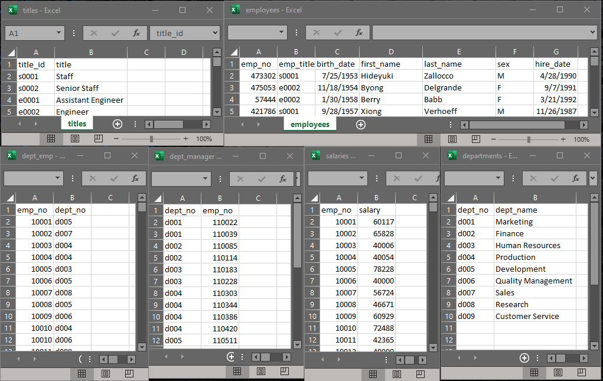
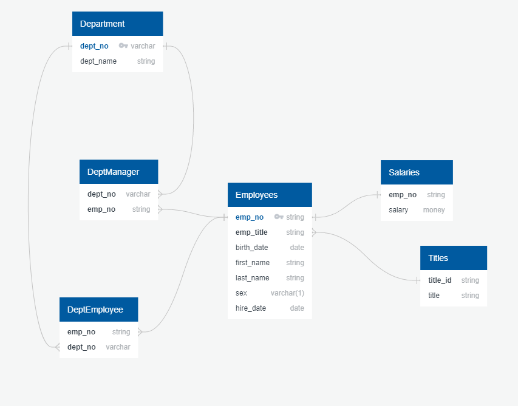
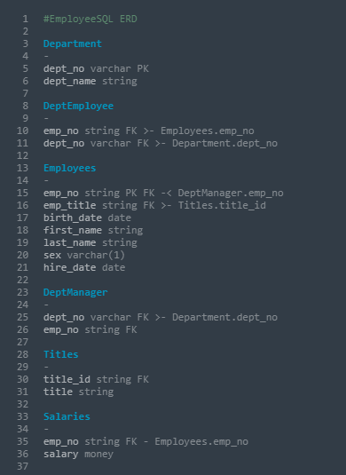
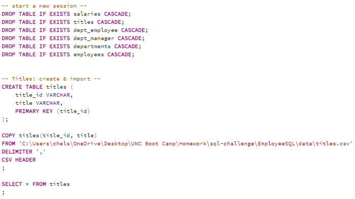
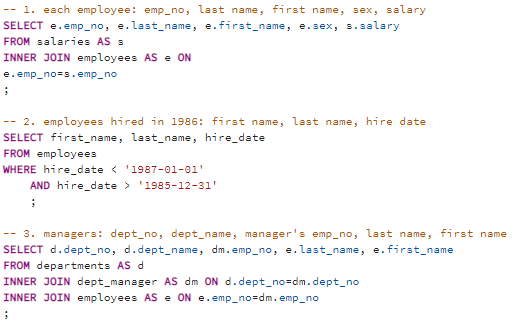

# SQL Homework - Employee Database

 
## Background

I was tasked with analyzing the employee data for the fictional company - Pewlett Hackard. 

#### Data Engineering & Data Analysis
Given six csv files, I...
> created tables to hold the data from the files 

> stored the tables in a SQL database 

> designed queries to answer questions about the data 
 

## Project Folder Outline

--This repository, __sql-challenge__, contains the main project folder, [EmployeeSQL](EmployeeSQL), where all files are stored: 
 

 
[Visuals Folder](EmployeeSQL/visuals) Folder -- contains images pertinent to the project 

> [Data Board](EmployeeSQL/visuals/data-board.PNG) -- a display of all opened csv files for ERD reference 

> [ERD visual](EmployeeSQL/visuals/erd-visual.PNG) -- a visual of a quickDBD to show the ERD  

> [ERD code](EmployeeSQL/visuals/erd-code.txt) -- the ERD code used to create the ERD visual 

[Data Folder](EmployeeSQL/data) --  contains the six csv files used in this project 

 
> [departments](EmployeeSQL/data/departments.csv) 

> [dept_emp](EmployeeSQL/data/dept_emp.csv) 

> [dept_manager](EmployeeSQL/data/dept_manager.csv) 

> [employees](EmployeeSQL/data/employees.csv) 

> [salaries](EmployeeSQL/data/salaries.csv) 

> [titles](EmployeeSQL/data/titles.csv) 

[table-schema.sql](EmployeeSQL/table_schema.sql) -- sql file that creates tables, copies csv file information, displays resulting table 

[queries.sql](EmployeeSQL/queries.sql) -- contains the queries used for data analysis 

> 1. Details of Employees: employee number, last name, first name, sex, and salary 

> 2. Hired in 1986: list first name, last name, and hire date for employees who were hired in 1986. 

> 3. Manager Information: department number, department name, the manager's employee number, last name, first name. 

> 4. Employee Departments: employee number, last name, first name, and department name. 

> 5. 'Hercules' + 'B': first name, last name, and sex for employees whose first name is "Hercules" and last names begin with "B." 

> 6. Sales Department: employee number, last name, first name, and department name. 

> 7. Sales and Development Departments: employee number, last name, first name, and department name. 

> 8. Descending order: frequency count of employee last names. 
 

## Visuals

#### Data Board
 

#### ERD Visual
 

#### ERD Code
 

#### Table Schema
 

 

